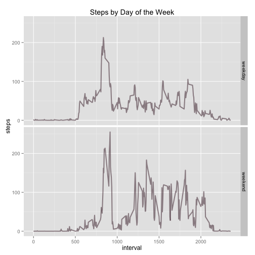

# Reproducible Research: Peer Assessment 1  
  
  
## Loading and preprocessing the data


```r
unzip("activity.zip")
act <- read.csv("activity.csv")
head(act)
```

```
##   steps       date interval
## 1    NA 2012-10-01        0
## 2    NA 2012-10-01        5
## 3    NA 2012-10-01       10
## 4    NA 2012-10-01       15
## 5    NA 2012-10-01       20
## 6    NA 2012-10-01       25
```


## What is mean total number of steps taken per day?
1. Make a histogram of the total number of steps taken each day


```r
stepsByDate <- tapply(act$steps, act$date, sum)
hist(stepsByDate, xlab="Total Steps per Day", main="Histogram of Total Steps by Date")
```

 

2. Calculate and report the mean and median total number of steps taken per day

```r
## check for missing values in stepsByDate
bad <- is.na(stepsByDate)
## calculate mean from days with values
stepsMean <- mean(stepsByDate[!bad])
stepsMean <- prettyNum(stepsMean, big.mark=",")
print(stepsMean)
```

```
## [1] "10,766"
```

```r
stepsMedian <- median(stepsByDate[!bad])
stepsMedian <- prettyNum(stepsMedian, big.mark=",")
print(stepsMedian)
```

```
## [1] "10,765"
```
  
- The mean of total number of steps taken per day is **10,766**.  
- The median of total number of steps taken per day is **10,765**.

## What is the average daily activity pattern?
1. Make a time series plot (i.e. type = "l") of the 5-minute interval (x-axis) and the average number of steps taken, averaged across all days (y-axis)


```r
## remove NAs from act$steps first
cleanSteps <- act$steps[!is.na(act$steps)]
cleanInterval <- act$interval[!is.na(act$steps)]
mean <- tapply(cleanSteps, cleanInterval, mean)
## create a data.frame based on the output of the tapply
stepsByInterval <- data.frame(interval=names(mean), avg.steps=mean)
stepsByInterval$interval <- as.numeric(as.character(stepsByInterval$interval))
stepsByInterval$avg.steps <- as.numeric(as.character(stepsByInterval$avg.steps))
plot(stepsByInterval$interval, stepsByInterval$avg.steps, type="l", xlab="5-Minute Intervals", ylab="Steps", main="Avg. Steps by 5-Minute Interval")
```

 

2. Which 5-minute interval, on average across all the days in the dataset, contains the maximum number of steps?


```r
max <- which.max(stepsByInterval$avg.steps)
maxInterval <- stepsByInterval[max,1]
print(maxInterval)
```

```
## [1] 835
```
The 5-minute interval with the highest average steps across all days would be **835**. 

## Imputing missing values  

1. Calculate and report the total number of missing values in the dataset (i.e. the total number of rows with NAs)


```r
rowswithNA <- sum(is.na(act))
rowswithNA <- prettyNum(rowswithNA, big.mark=",")
print(rowswithNA)
```

```
## [1] "2,304"
```

- Overall, total rows with missing values are **2,304**.  

2. Devise a strategy for filling in all of the missing values in the dataset. The strategy does not need to be sophisticated. For example, you could use the mean/median for that day, or the mean for that 5-minute interval, etc.  

- Strategy: If a steps observation is missing, use the mean for that 5-minute interval.  

3. Create a new dataset that is equal to the original dataset but with the missing data filled in.


```r
## construct a function that returns the mean of the target interval
naSub <- function(n) {
    ## store target interval value in int
    int <- act[n, "interval"]
    ## construct a pattern that contains only the interval value
    pattern <- paste("^", int, "$", sep="")
    ## search the interval value in stepsByInterval data.frame
    rowNum <- grep(pattern, stepsByInterval[, 1])
    ## return the mean steps based on the target interval value
    stepsByInterval[rowNum, 2]
    
}

## loop thru all the values in the original dataset, and run naSub
## function if an NA is found
actNew <- data.frame()
for (i in 1:nrow(act)) {
    if (is.na(act[i,1])) {
        actNew[i, 1] <- naSub(i)
    }
    else {
        actNew[i, 1] <- act[i, 1]
    }
}

## pass the other two columns from the original dataset to the new one
actNew[, 2] <- act[, 2]
actNew[, 3] <- act[, 3]
names(actNew) <- names(act)
head(actNew)
```

```
##     steps       date interval
## 1 1.71698 2012-10-01        0
## 2 0.33962 2012-10-01        5
## 3 0.13208 2012-10-01       10
## 4 0.15094 2012-10-01       15
## 5 0.07547 2012-10-01       20
## 6 2.09434 2012-10-01       25
```

4. Make a histogram of the total number of steps taken each day and Calculate and report the mean and median total number of steps taken per day. Do these values differ from the estimates from the first part of the assignment? What is the impact of imputing missing data on the estimates of the total daily number of steps?

- Total number of steps taken each day  


```r
stepsByDateNew <- tapply(actNew$steps, actNew$date, sum)
hist(stepsByDateNew, xlab="Total Steps per Day", main="Histogram of Total Steps by Date")  
```

 

- Mean and median total number of steps taken perday  


```r
stepsMeanNew <- mean(stepsByDateNew)
stepsMeanNew <- prettyNum(stepsMeanNew, big.mark=",")
print(stepsMeanNew)
```

```
## [1] "10,766"
```

```r
stepsMedianNew <- median(stepsByDateNew)
stepsMedianNew <- prettyNum(stepsMedianNew, big.mark=",")
print(stepsMedianNew)
```

```
## [1] "10,766"
```
  
- The mean of total number of steps taken per day is **10,766**.  
- The median of total number of steps taken per day is **10,766**.
- Values do not differ in a substantial extent from the first part of the assignment. The impact of imputing mising data on the estimates of the total daily number of steps is **minimal**.

## Are there differences in activity patterns between weekdays and weekends?

1. Create a new factor variable in the dataset with two levels – “weekday” and “weekend” indicating whether a given date is a weekday or weekend day.


```r
## change date column format to date
actNew$date <- as.Date(actNew$date)

for (i in 1:nrow(actNew)) {
    if (weekdays(actNew[i,2], abbreviate=TRUE) == "Sat" | weekdays(actNew[i,2]) == "Sun") {
        actNew[i, 4] <- "weekend"
    }
    else {
        actNew[i, 4] <- "weekday"
    }
}

colnames(actNew)[4] <- "day"
head(actNew)  
```

```
##     steps       date interval     day
## 1 1.71698 2012-10-01        0 weekday
## 2 0.33962 2012-10-01        5 weekday
## 3 0.13208 2012-10-01       10 weekday
## 4 0.15094 2012-10-01       15 weekday
## 5 0.07547 2012-10-01       20 weekday
## 6 2.09434 2012-10-01       25 weekday
```

2. Make a panel plot containing a time series plot (i.e. type = "l") of the 5-minute interval (x-axis) and the average number of steps taken, averaged across all weekday days or weekend days (y-axis). The plot should look something like the following, which was creating using simulated data:


```r
## split actNew into two groups: weekdays and weekends
split <- split(actNew, actNew$day)
## apply tapply invidiually to each group, generate a new data.frame
weekAct <- sapply(split, function(x) tapply(x$steps, x$interval,mean))
weekAct <- data.frame(weekAct)
## reorganize the data.frame to let it contain interval
weekAct <- data.frame(interval=rownames(weekAct), weekday=weekAct$weekday, weekend=weekAct$weekend)
weekAct$interval <- as.numeric(as.character(weekAct$interval))
## clean up the data.frame to only contain three columns
weekday <- weekAct[, c(1,2)]
weekday[,3] <- "weekday"
names(weekday) <- c("interval", "steps", "day")
weekend <- weekAct[, c(1,3)]
weekend[,3] <- "weekend"
names(weekend) <- c("interval", "steps", "day")
meanStepsDay <- rbind(weekday, weekend)

## consturcting the plot with ggplot
library(ggplot2)
ggplot(meanStepsDay, aes(interval, steps)) + geom_line(size=1, alpha=1/2, col=rgb(0.255,.12,.18)) + facet_grid(day ~ .) + labs(title = "Steps by Day of the Week")
```

 


